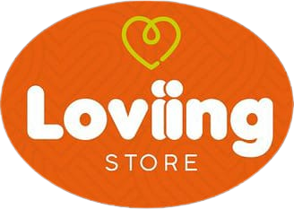

## Sobre Loviing Store

Loviing Store es una empresa que ofrece una amplia variedad de productos, incluyendo artículos para mascotas, utensilios de cocina, juguetes (tanto para niños como para mascotas), ropa, accesorios tecnológicos (como cables USB y mousepads) y demás. Este proyecto de e-commerce y gestión de inventario está diseñado específicamente para satisfacer las necesidades de Loviing Store, permitiendo una gestión eficiente y una experiencia de compra en línea optimizada para sus clientes.

## Equipo de trabajo

- Juan David Zabala Tapiero
- Jean Carlos Velandia Fonseca
- Joseph Esteban Vargas García
- Michael Stiven Bastidas Gómez
- Karen Daniela Bustos Pinilla

## Tecnologías usadas

- HTML
- CSS (Con Bootstrap y Sass)
- JS (Con JQuery y SheetJS)
- PHP (Con Composer)
- MySQL

## APIs usadas

- Mercado Pago
